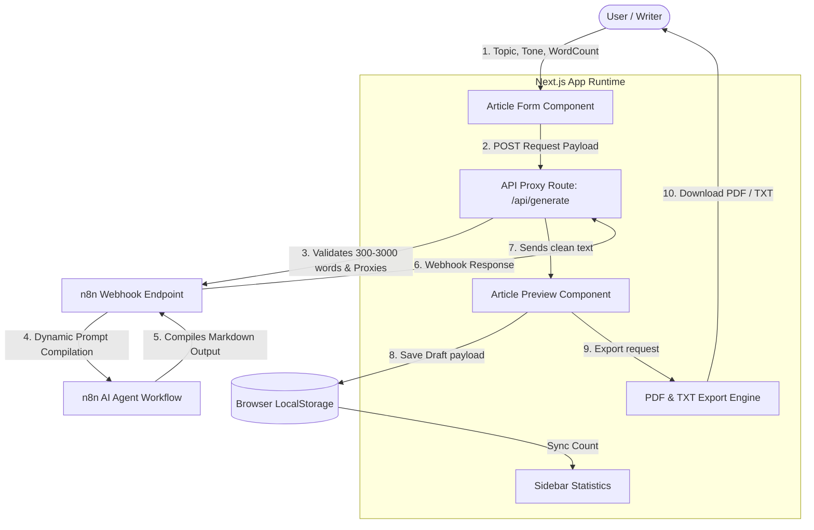

# Draft-IQ — Premium AI Article & Content Generator

Draft-IQ is an enterprise-grade content generation platform built with Next.js, Framer Motion, and Tailwind CSS. It leverages a server-side proxy to connect securely with a dynamic n8n AI agent workflow, allowing writers to create production-ready, SEO-optimized articles in seconds.

---

## 📊 Data Flow Diagram (DFD)

The diagram below illustrates the path of data from user parameters down through validation, remote webhook processing, content compilation, and export:



---

## 🚀 Key Features

*   **Dynamic Word Count Engine**: Request article lengths between `300` and `3000` words. The backend sanitizes inputs and forwards them directly to the AI agent prompts.
*   **Custom Parsing Engine**: Automatically formats dynamic structures:
    *   `[Heading]` → styled `<h2>` with modern border indicators.
    *   `{Subheading}` → styled bold `<h3>` sub-headers.
    *   `** bullet text` → dot list items (hides raw markdown formatting).
    *   Strips out `# / ## / ###` characters for human-grade copy visibility.
*   **Content-First UI**: Newly reordered viewer stacks the completed article at the top, putting analytics, keywords, and quality scorecards cleanly below.
*   **Local Persistence**: Fully persistent history browser built on top of LocalStorage, featuring stats counters, search options, and draft restoration.
*   **Production Handcrafted Aesthetics**: Custom glassmorphism cards, glowing radial mesh backdrops, floating keyframes, and full keyboard-navigable accessibility (ARIA).

---

## 🛠️ Tech Stack

*   **Framework**: Next.js 15 (App Router)
*   **Type Safety**: TypeScript 5
*   **Animations**: Framer Motion 12
*   **Styling**: Tailwind CSS 4 & PostCSS
*   **Document Generation**: jsPDF
*   **Integration**: n8n automation webhook (`/webhook/generate-article`)

---

## ⚙️ Development Setup

First, install local package dependencies:
```bash
npm install
```

Start the local development server:
```bash
npm run dev
```

Build the production-ready bundle (cleanly verified, type-checked):
```bash
npm run build
```
